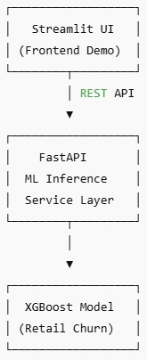
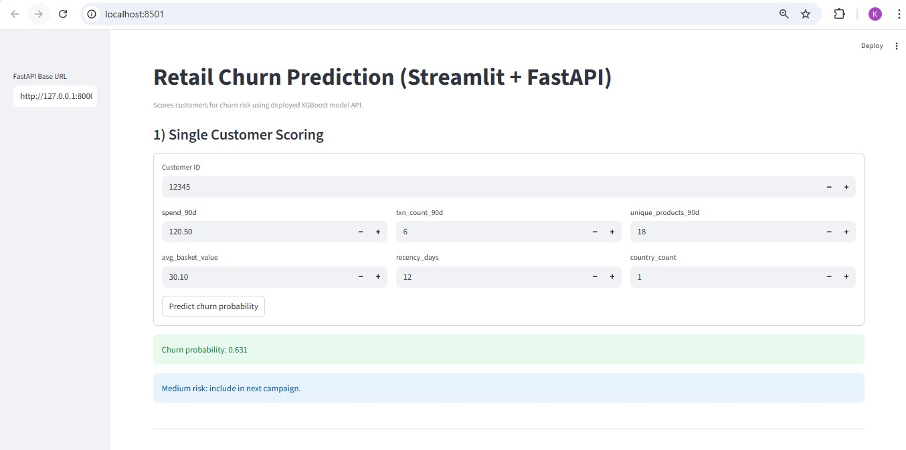
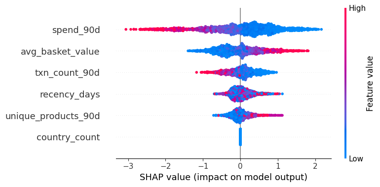
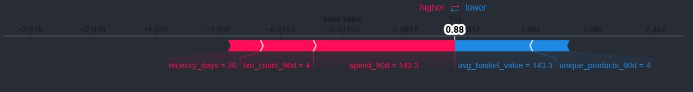

# Architecture & Deployment

## System Architecture

This project is built using a  **decoupled ML deployment architecture** , separating model inference from the user interface.

## Deployment

* The API enforces feature order using `models/feature_columns.json` saved from training to prevent XGBoost feature mismatch errors.

## Why this architecture?

* **FastAPI** hosts the trained XGBoost churn model as a reusable inference service
* **Streamlit** provides a lightweight UI for business users and demos
* The same API can be reused by:
  * dashboards
  * batch jobs
  * other applications
  * production systems

## Dataset

Source: [https://archive.ics.uci.edu/dataset/352/online+retail]

Location: (`data/raw/`)

## Model Overview

* **Problem:** Predict customer churn (no purchase in next 30 days)
* **Domain:** Retail & Consumer
* **Features:** RFM + behavioral features (recency, frequency, spend, basket size, product diversity)
* **Model:** XGBoost
* **Explainability:** SHAP (global + individual explanations)
* **Business Metric:** Lift @ Top 10% customers

## Run Locally (Step-by-Step)

### 1. Activate virtual environment

From the project root:

***virtual_env\Scripts\activate*

***pip install -r requirements.txt*

### 2. Start the FastAPI inference service

Run in Terminal 1 :

***uvicorn app.main:app --reload*

FastAPI will be available at:

* API: `http://127.0.0.1:8000`
* Swagger Docs: `http://127.0.0.1:8000/docs`

  

Swagger is used for testing and debugging.

It is not required for normal app usage.

### 3. Start the Streamlit UI

Run in Terminal 2 :

***streamlit run streamlit_app.py*

Streamlit will open automatically at:

*[http://localhost:8501]*

### Streamlit Application Features

The Streamlit UI consumes the FastAPI endpoints and provides:

### Single Customer Scoring

* Manually enter customer behavioral features
* Get real-time churn probability
* Simple risk interpretation (high / medium / low)

### Batch Scoring from Project Dataset

* Load `data/processed/modeling_table.csv`
* Score hundreds of customers via the API
* Rank customers by churn risk
* Download predictions as CS

  

#### Map insights → Retail actions

| Insight       | Business Action                            |
| ------------- | ------------------------------------------ |
| High recency  | Win-back email / reminder                  |
| Low frequency | Loyalty points / repeat-purchase incentive |
| Low spend     | Personalized discount                      |
| Low diversity | Cross-sell recommendations                 |

## Explainability (SHAP + Business Insights)

## SHAP Force Plot

## Results

| Model    | ROC-AUC | PR-AUC | Lift@10% |
| -------- | ------- | ------ | -------- |
| Logistic | 0.64    | 0.65   | 1.12     |
| XGBoost  | 0.67    | 0.69   | 1.27     |

## Business Impact (Lift Analysis)

The base churn rate in the dataset is ~57%.
Using the XGBoost model, the top 10% highest-risk customers exhibit a churn rate of ~72%, resulting in a Lift@10% of 1.27.

This indicates that the model improves churn targeting efficiency by ~27% compared to random selection, which is meaningful for retail retention campaigns where churn is inherently high.

## Production-Ready Design Choices

* Feature order enforced using `feature_columns.json`
* API validates inputs with Pydantic schemas
* Model inference isolated from UI logic
* No data leakage between training and inference
* Easy to extend to:
  * scheduled batch jobs
  * cloud deployment
  * additional frontends
